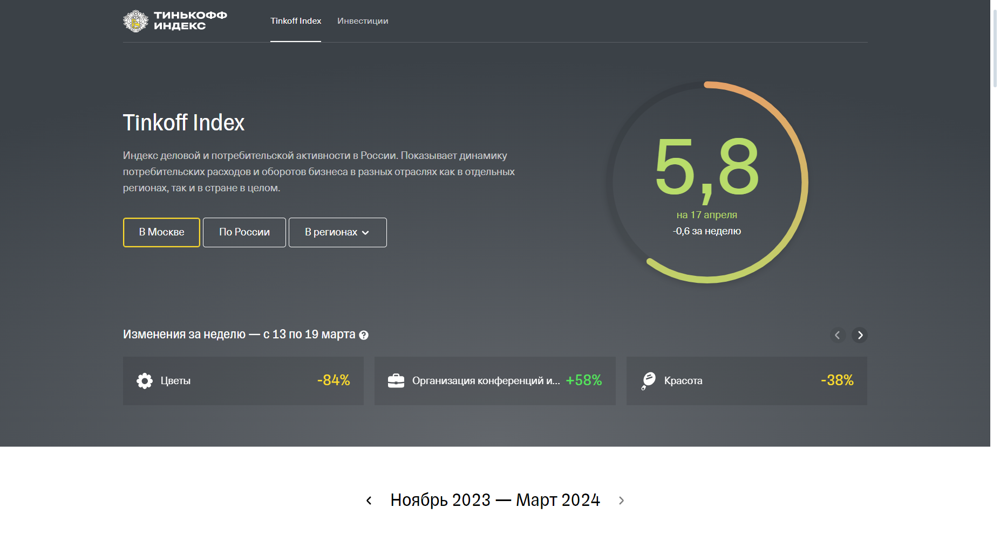

# Парсинг Индекса Тинькофф by das1204



Программное решение, которое:
* Парсит данные для всех доступных регионов РФ и РФ (список ```regs``` в файле ```main.py```) с сайта [Tinkoff CoronaIndex](https://index.tinkoff.ru/):
  * Индекс "Траты потребителей", "Разнообразие покупок" и категории (список ```consumer_types``` в файле ```main.py```)
  * Индекс "Обороты бизнеса" и категории (список ```business_types``` в файле ```main.py```)

<!--Установка-->
## Установка
У вас должны быть установлены [зависимости проекта](https://github.com/das1204/Tinkoff-Index#зависимости)

1. Клонирование репозитория 

```git clone https://github.com/das1204/Tinkoff-Index.git```

2. Переход в директорию Tinkoff-Index

```cd Tinkoff-Index```

3. Установка зависимостей

```pip install -r requirements.txt```

4. Запуск скрипта для демонстрации работы

```python app.py```


<!--зависимости-->
## Зависимости
Эта программа зависит от интепретатора Python версии 3.9 или выше.

<!--Логика работы-->
